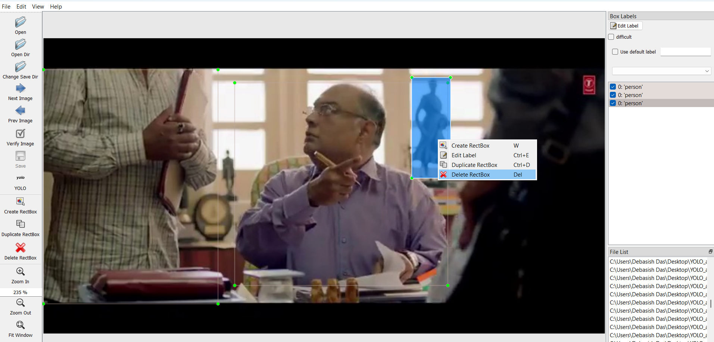
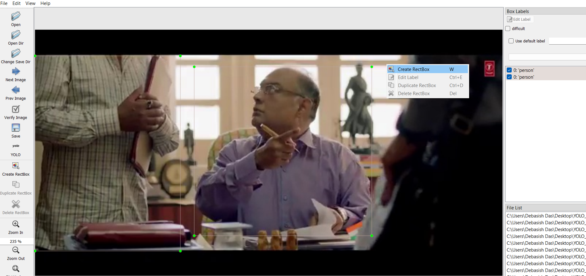
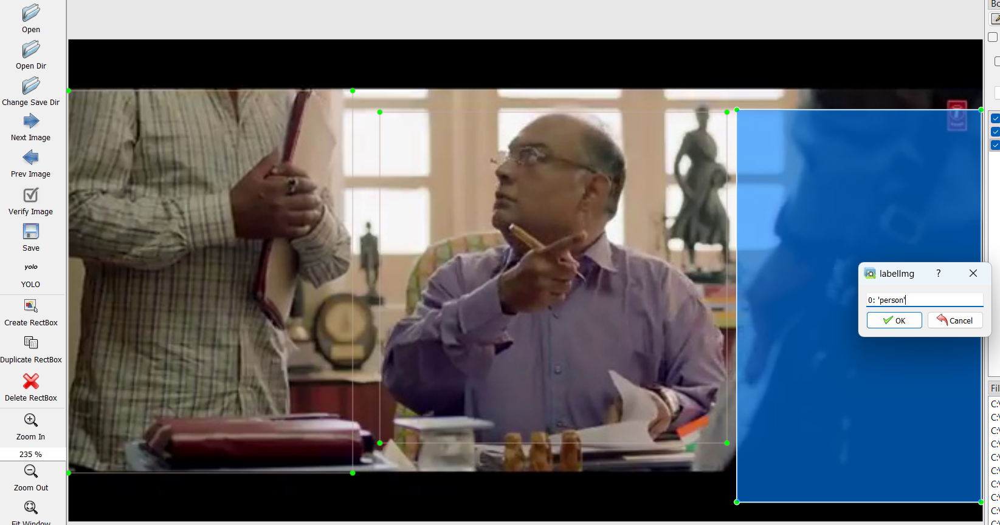

# Object-Detection-Dataset-for-Movie-Analytics-Using-YOLO-and-DETR

This repository provides tools for automated movie analytics by detecting and analyzing objects in keyframes extracted from movies. It utilizes both YOLO (You Only Look Once) and DETR (DEtection TRansformer) models for object detection, with a focus on combining their strengths.

---
- [Click Me To Download The Movie Data Set](https://drive.google.com/drive/folders/0AKbuZk061IX9Uk9PVA)

## Features

- **Keyframe Extraction**: Extracts keyframes from videos for analysis.
- **Object Detection**: Combines YOLO and DETR detections for enhanced accuracy.
- **Bounding Box Union**: Merges detections of the same object from both models.
- **Confidence Filtering**: Filters results with a confidence score greater than 0.5.
- **OOP Design**: Implements object detection using a modular, class-based approach.

---

## Repository Structure

| File/Folder         | Description                                                                           |
|---------------------|---------------------------------------------------------------------------------------|
| `.gitignore`        | Specifies files and folders to be ignored by Git to maintain a clean repository.     |
| `Detect_Object.py`  | Contains the primary logic for object detection using YOLO and DETR models.          |
| `LICENSE`           | Contains the MIT license for the repository.                                         |
| `README.md`         | Provides an overview and instructions for using the repository.                      |
| `Url_to_Frame.py`   | Script for extracting keyframes from video URLs.                                      |
| `main.py`           | Orchestrates the pipeline, from keyframe extraction to object detection.             |
| `requirements.txt`  | Lists all required Python libraries for the project.                                 |

---

## Installation

### Prerequisites

- Python 3.8 or later
- Required Python libraries (listed in `requirements.txt`)
- YOLO weights (`yolov8n.pt`) and DETR model files (downloaded automatically by the scripts)

### Setup

1. Clone the repository:
   ```bash
   git clone https://github.com/ai4sees/Object-Detection-Dataset-for-Movie-Analytics-Using-YOLO-and-DETR.git
   ```

2. Navigate to the project directory:
   ```bash
   cd Object-Detection-Dataset-for-Movie-Analytics-Using-YOLO-and-DETR
   ```

3. Install dependencies:
   ```bash
   pip install -r requirements.txt
   ```

---

## Usage

### 1. Extract Keyframes

Run `Url_to_Frame.py` to extract keyframes from a video URL or local video file. Keyframes will be stored in the specified directory.

### 2. Perform Object Detection

Run the main detection script `main.py`:
```bash
python main.py
```

You have to put `"video_url"` in the `main.py` Pyhton file. The Output will be saved in the `movie_title\Keyframe` and `movie_title\results` Folder.

### 3. Outputs
- **Extracting Key Frame**:Each Key Frame Store in the `Key_Frame` folder

- **Detection Results**: Each processed frame generates a text file in the `results` folder. Each line contains:
  ```
  class_id,x_min,y_min,x_max,y_max
  ```
---

## Example Result File

A result file (`img_1.txt`) will look like:
```
1,50,60,200,300
2,400,350,500,450
```
Here, `1` and `2` represent class IDs, followed by the bounding box coordinates.

### 4.Human Annotation Using LabelImg

**LabelImg** is a graphical image annotation tool that is widely used for creating bounding box annotations for object detection tasks. It allows users to annotate images by drawing bounding boxes around objects of interest and assigning labels to those boxes.

#### Steps for Human Annotation Using LabelImg

1. **Installation**:
   - LabelImg can be installed using Python and is available on GitHub. You can install it via pip or clone the repository:
     ```bash
     pip install labelImg
     ```
   - Alternatively, you can clone the repository and run the application:
     ```bash
     git clone https://github.com/tzutalin/labelImg.git
     cd labelImg
     python labelImg
     ```
### Making Corrections in LabelImg

If you need to make corrections to existing annotations in LabelImg, follow these steps:

### Correction of annotations using LabelImg 
####  Delete Extra Annotations

#### Create Annotations

#### Create Label 



---


---

1. **Open Existing Annotations**:
   - Load the directory containing your annotated images and their corresponding annotation files.

2. **Select an Image**:
   - Navigate to the image you want to correct using the arrow keys or by clicking on it in the file list.

3. **Editing Bounding Boxes**:
   - To edit an existing bounding box, click on it to select it. You will see handles appear at the corners of the box.
   - Drag these handles to resize or reposition the bounding box as needed.
   - If you need to change the label, click on the bounding box again, and a dialog will appear allowing you to edit the label.

4. **Deleting Bounding Boxes**:
   - To delete a bounding box, select it and press the `Delete` key or click on the **Delete RectBox** button.

5. **Saving Changes**:
   - After making corrections, save your changes by clicking on **Save** or pressing `Ctrl+S`.

6. **Reviewing Corrections**:
   - It’s advisable to review all annotations after making corrections to ensure accuracy before finalizing your dataset.

---

## Technologies Used

- **YOLOv8**: Efficient object detection.
- **DETR**: Transformer-based detection for high accuracy.
- **OpenCV**: For reading and processing frames.
- **PyTorch Transformers**: For implementing DETR.
- **LabelImg** : 

---

